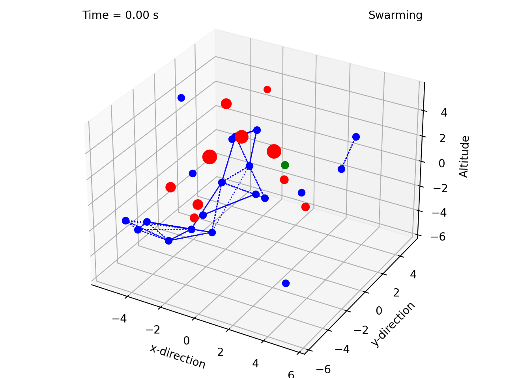
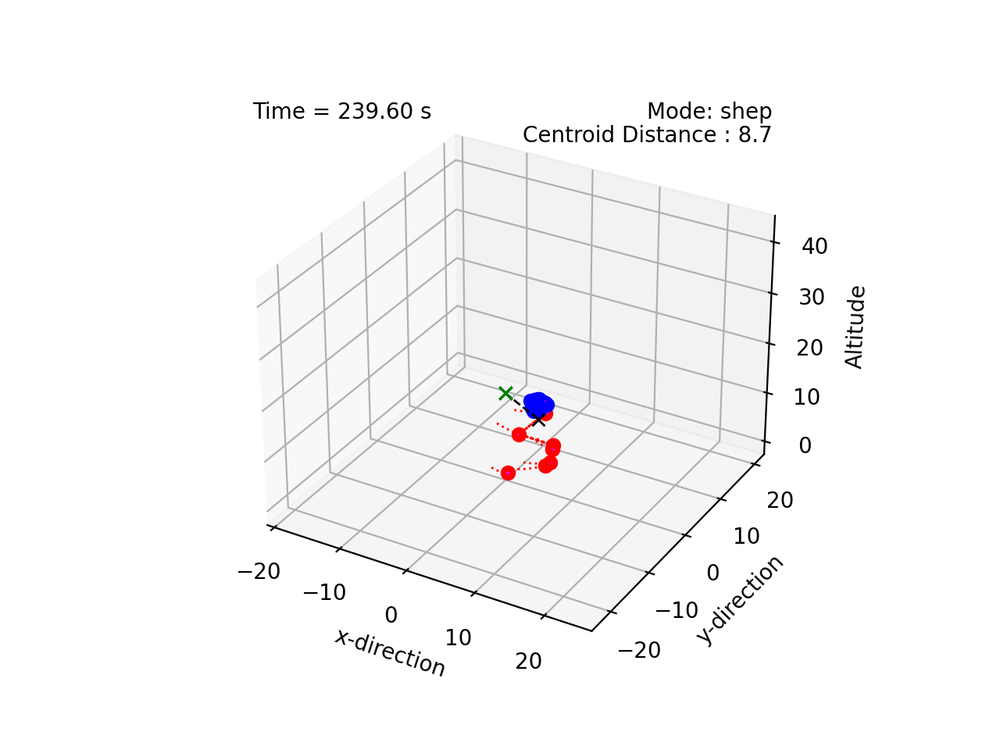
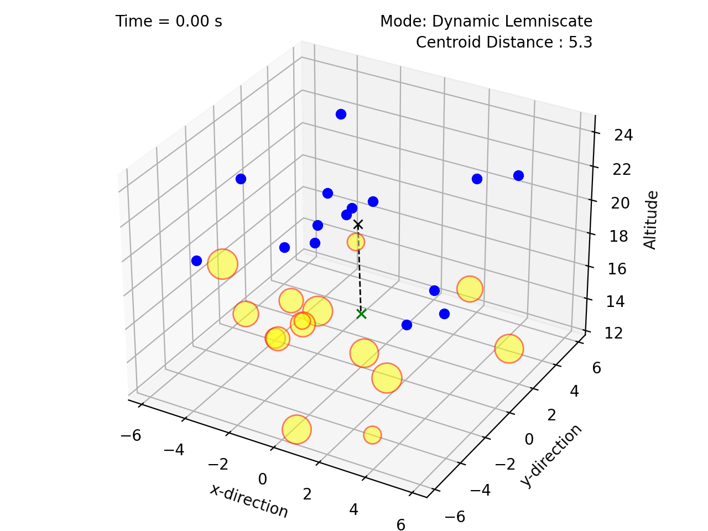
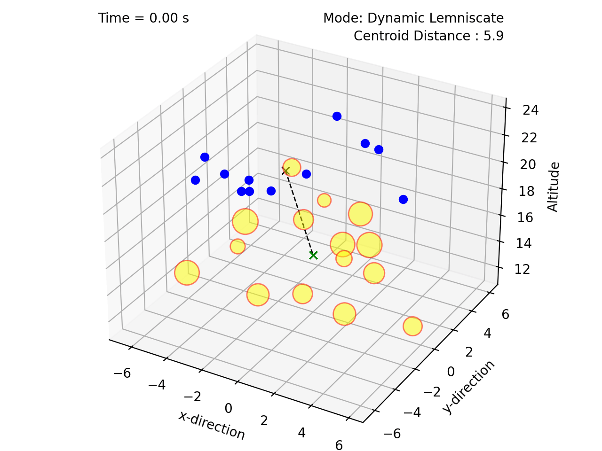
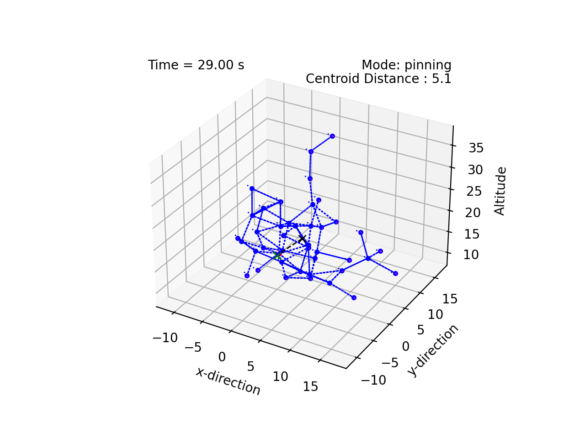
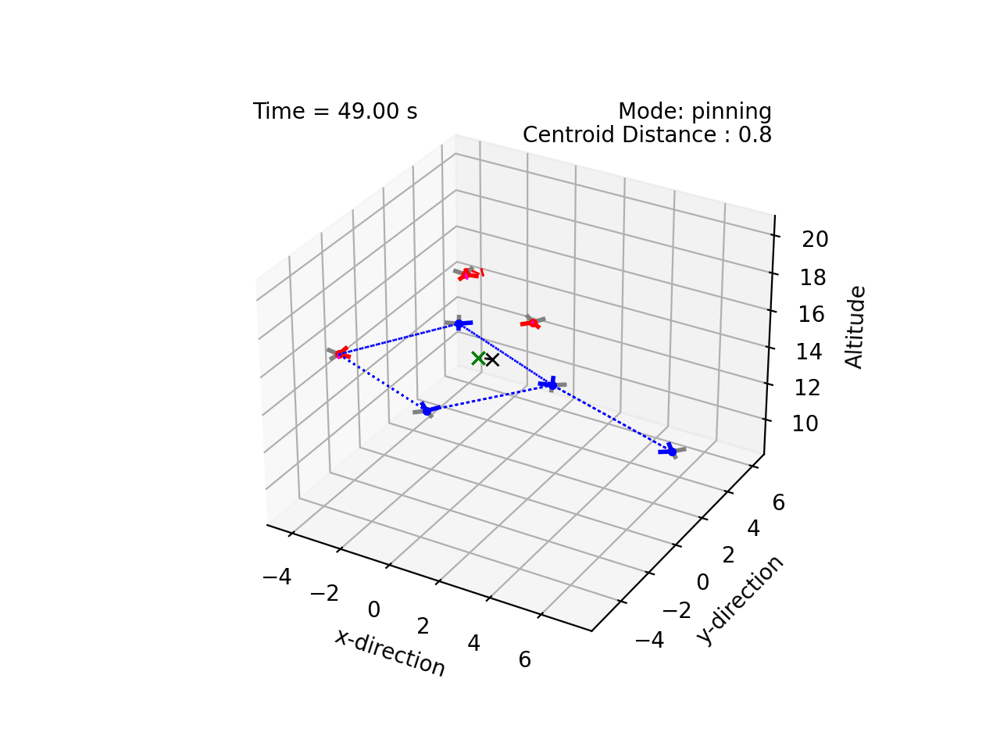

# Multiagent Coordination Simulator

This project implements various multiagent coordination techniques, including:

* Reynolds rules of flocking ("boids")
* Olfati-Saber flocking
* Starling flocking
* Dynamic Encirclement 
* Heterogeneous Pinning Control
* Arbitrary Closed Curves 
* Shepherding

All agents make individual decisions based on local information only. There is no global plan. 

Some other features:

*  Interconnectedness is represented as a Graph
*  Supports [asymetric lattice sizes](https://github.com/tjards/asymmetric_lattices)
*  Supports [reinforcement learning to adjust flocking scale](https://github.com/tjards/assembly_via_Q-learning)
*  Lemniscates are formed as [twisted circles](https://github.com/tjards/twisted_circles)

# Methodology

The swarming techniques above are all implemented as high-level trajectory planners, assuming underlying double integrator dynamics. 
When quadcopter dynamics are applicable, these command signals - which take the form of accelerations in Cartesian space - are then converted into velocity setpoints.
The quadcopters make use of 3 nested control loops (translational velocity, angular position, and angular velocity) to track the desired trajectory.

# Demonstrations

## Flocking, Shepherding, and Encirclement 


    
    
    


## Lemniscate Trajectories


    
    
    


## Pinning Control (Undirected Graph)


    


## Quadcopter dynamics (Directed Graph)



      


# References 

1. Craig Reynolds, ["Flocks, Herds, and Schools:A Distributed Behavioral Model"](https://www.red3d.com/cwr/papers/1987/boids.html), *Computer Graphics, 21(4) (SIGGRAPH '87 Conference Proceedings)*, pages 25-34, 1987.
2. Reza Olfati-Saber, ["Flocking for Multi-Agent Dynamic Systems: Algorithms and Theory"](https://ieeexplore.ieee.org/document/1605401), *IEEE Transactions on Automatic Control*, 
Vol. 51 (3), 2006.
3. H. Hildenbrandt, C. Carere, and C.K. Hemelrijk,["Self-organized aerial displays of thousands of starlings: a model"](https://academic.oup.com/beheco/article/21/6/1349/333856?login=false), *Behavioral Ecology*, Volume 21, Issue 6, pages 1349–1359, 2010.
4. P. T. Jardine and S. N. Givigi, ["Bimodal Dynamic Swarms"](https://ieeexplore.ieee.org/document/9857917), *IEEE Access*, vol. 10, pp. 94487-94495, 2022.
5. P. T. Jardine and S. N. Givigi, ["Flocks, Mobs, and Figure Eights: Swarming as a Lemniscatic Arch"](https://ieeexplore.ieee.org/document/9931405), *IEEE Transactions on Network Science and Engineering*, 2022.
6. Kléber M. Cabral, Sidney N. Givigi, and Peter T. Jardine, [Autonomous assembly of structures using pinning control and formation algorithms](https://ieeexplore-ieee-org.proxy.queensu.ca/document/9275901) in 2020 IEEE International Systems Conference (SysCon), 07 Dec 2020
7. S. Van Havermaet et al. [Steering herds away from dangers in dynamic environments](https://royalsocietypublishing.org/doi/10.1098/rsos.230015) in *Royal Society Open Science*, 2023
8. Credit goes to [bobzwik](https://github.com/bobzwik) for providing the majority of the [Quadcopter dynamics module](https://github.com/tjards/multi-agent_sim/tree/master/agents/quadcopter_module) code under MIT licence, which I modified to suit this application (portions of the code are annotated appropriately)

# Citing

The code is opensource but, if you reference this work in your own reserach, please cite me. I have provided an example bibtex citation below:

`@techreport{Jardine-2023,
  title={Multiagent Coordination Simulator},
  author={Jardine, P.T.},
  year={2023},
  institution={Royal Military College of Canada, Kingston, Ontario},
  type={GitHub Repository},
}`

Alternatively, you can cite any of my related papers, which are listed in [Google Scholar](https://scholar.google.com/citations?hl=en&user=RGlv4ZUAAAAJ&view_op=list_works&sortby=pubdate).















 

