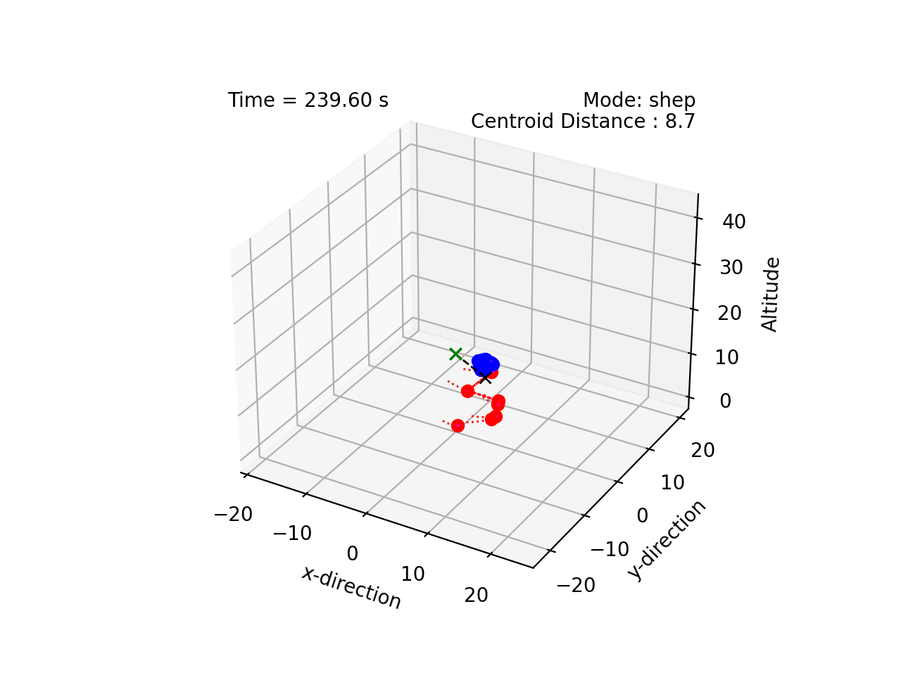

# Multiagent Coordination Simulator

This project implements various multiagent coordination techniques, including:

    - Reynolds rules of flocking ("boids")
    - Olfati-Saber flocking
    - Starling flocking
    - Dynamic Encirclement 
    - Heterogeneous Pinning Control
    - Arbitrary Closed Curves 
    - Shepherding

All agents make individual decisions based on local information only. There is no global plan. The code builds on our (now archived) earlier work in [Swarming Simulator v3](https://github.com/tjards/swarming_sim)

# Demonstrations

Video of *autonomous assembly of closed curves* with random arrival and depature. The closed curves include Lemniscates of Bernoulli and Gerono and a Dumbbell Curve:


    
    


This plot demonstrates the agents automatically tightening up their *spacing*, as more agents join the swarm:


    
    


More demonstration of *lemniscates* of Bernoulli, Gerono (with phase shift), and Dumbbell in a *cluttered environment*:


    
    
    


This program also implements heterogeneous *Pinning Control* with autonomous pin selection based on Controlability Gramian:


    
    



An illustration of Shepherding:


    



# References 

1. Craig Reynolds, ["Flocks, Herds, and Schools:A Distributed Behavioral Model"](https://www.red3d.com/cwr/papers/1987/boids.html), *Computer Graphics, 21(4) (SIGGRAPH '87 Conference Proceedings)*, pages 25-34, 1987.
2. Reza Olfati-Saber, ["Flocking for Multi-Agent Dynamic Systems: Algorithms and Theory"](https://ieeexplore.ieee.org/document/1605401), *IEEE Transactions on Automatic Control*, 
Vol. 51 (3), 2006.
3. H. Hildenbrandt, C. Carere, and C.K. Hemelrijk,["Self-organized aerial displays of thousands of starlings: a model"](https://academic.oup.com/beheco/article/21/6/1349/333856?login=false), *Behavioral Ecology*, Volume 21, Issue 6, pages 1349–1359, 2010.
4. P. T. Jardine and S. N. Givigi, ["Bimodal Dynamic Swarms"](https://ieeexplore.ieee.org/document/9857917), *IEEE Access*, vol. 10, pp. 94487-94495, 2022.
5. P. T. Jardine and S. N. Givigi, ["Flocks, Mobs, and Figure Eights: Swarming as a Lemniscatic Arch"](https://ieeexplore.ieee.org/document/9931405), *IEEE Transactions on Network Science and Engineering*, 2022.
6. Kléber M. Cabral, Sidney N. Givigi, and Peter T. Jardine, [Autonomous assembly of structures using pinning control and formation algorithms](https://ieeexplore-ieee-org.proxy.queensu.ca/document/9275901) in 2020 IEEE International Systems Conference (SysCon), 07 Dec 2020
7. S. Van Havermaet et al. [Steering herds away from dangers in dynamic environments](https://royalsocietypublishing.org/doi/10.1098/rsos.230015) in *Royal Society Open Science*, 2023


# Citing

The code is opensource but, if you reference this work in your own reserach, please cite me. I have provided an example bibtex citation below:

`@techreport{Jardine-2023,
  title={Multiagent Coordination Simulator},
  author={Jardine, P.T.},
  year={2023},
  institution={Royal Military College of Canada, Kingston, Ontario},
  type={GitHub Repository},
}`

Alternatively, you can cite any of my related papers, which are listed in [Google Scholar](https://scholar.google.com/citations?hl=en&user=RGlv4ZUAAAAJ&view_op=list_works&sortby=pubdate).















 

