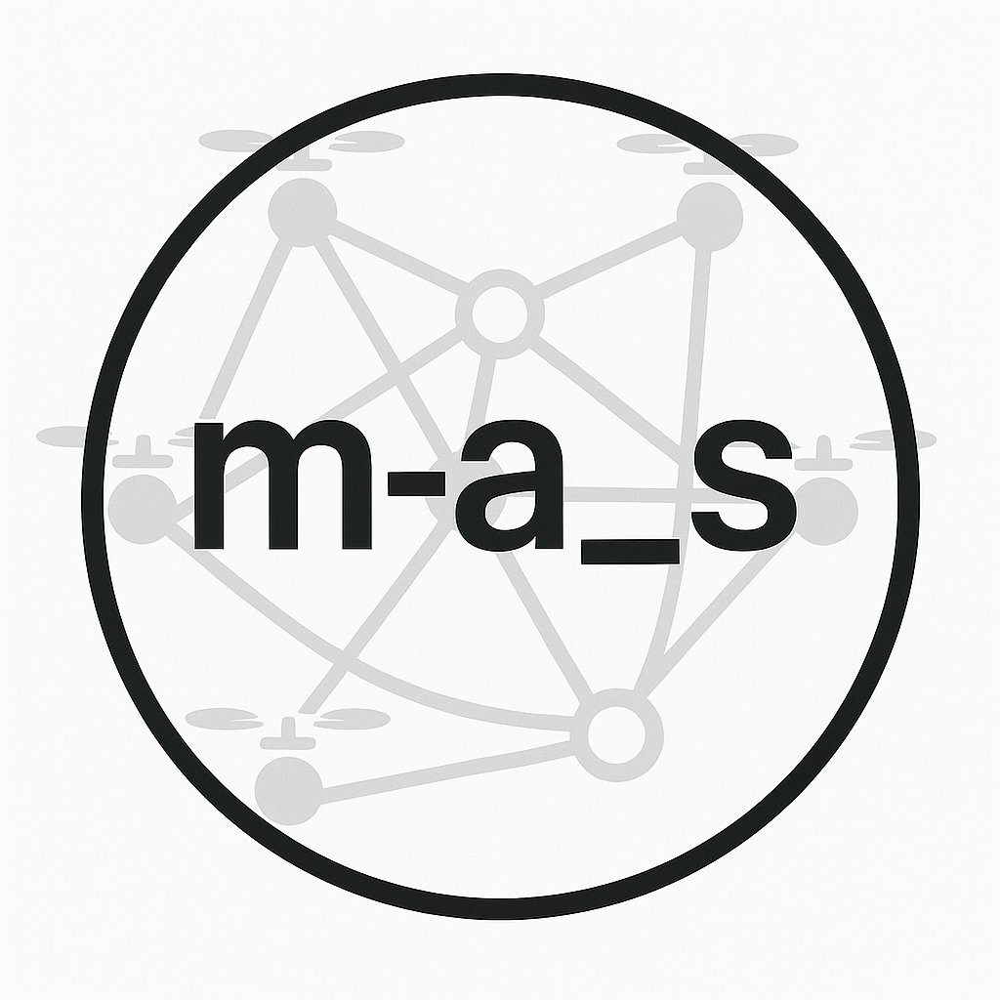

<p align="center">
  
</p>

# Multi-agent Swarming Simulator

An open architecture multi-agent simulator for use by academic researchers. Implemented techniques include:

- Flocking (reynolds, starling, and olfati-saber)
- Structured swarming (lemniscates, encirclement)
- Shepherding
- Various lattice assembly techniques using pinning control

Agents make decentralized decisions asynchronously based on local information only. There is no global plan. 

---

Documentation:
- Detailed project documentation is generated automatically by an LLM agent (most recently, Claude Haiku 4.5) after significant updates and pushed [here](./docs/documentation.md). 
- I also maintain rough development notes for myself [here](./docs/devnotes.md).

---

# Methodology

The swarming techniques above are all implemented as high-level trajectory planners, assuming underlying double integrator dynamics. 
When quadcopter dynamics are applicable, these command signals - which take the form of accelerations in Cartesian space - are then converted into velocity setpoints.
The quadcopters make use of 3 nested control loops (translational velocity, angular position, and angular velocity) to track the desired trajectory.

---

# Project Structure


```
├── requirements.txt         # python package dependencies
├── agents/                  # agent definitions
├── config/                  # location of configuration file
├── data/                    # data storage
├── experiments/             # consolidated data, configs, plots (when flagged)
├── learner/                 # learning-related modules
├── obstacles/               # obstacle definitions 
├── planner/                 # swarming techniques stored as "planners"
│   ├── trajectory.py        # placeholder for trajectory definitions
│   └── techniques/          # technique definitions
├── targets/                 # target definitions
├── tests/                   # unit tests and benchmarks
├── utils/                   # utility scripts
├── venv/                    # python virtual environment
├── visualization/           # animations and plots
├── orchestrator.py          # master controller (integrates all other components)
├── main.py                  # main script
```

---

# Examples

Below are some thematic examples, including visualizations.

- [Basic Interactions](./docs/readme_subpages/interactions.md) 
- [Dynamic Structures with Reinforcement Learning](./docs/readme_subpages/dynamic_structures.md) 
- [Malicious Agents](./docs/readme_subpages/malicious_agents.md) 


---

# Setup

Create and activate the virtual environment:

```bash
source venv/bin/activate
```

Install dependencies:

```bash
pip install -r requirements.txt
```

---

# Operation

Most parameters are centralized in `config/config.json`. Some of the learning-related parameters are still stored within the specific modules as they are in development, but these will be moved into the config in later versions. 

To run a simulation, adjust the parameters as desired and then run as follows from the root folder:

```bash
 python main.py
```
---

# References 

1. Craig Reynolds, ["Flocks, Herds, and Schools:A Distributed Behavioral Model"](https://www.red3d.com/cwr/papers/1987/boids.html), *Computer Graphics, 21(4) (SIGGRAPH '87 Conference Proceedings)*, pages 25-34, 1987.
2. Reza Olfati-Saber, ["Flocking for Multi-Agent Dynamic Systems: Algorithms and Theory"](https://ieeexplore.ieee.org/document/1605401), *IEEE Transactions on Automatic Control*, 
Vol. 51 (3), 2006.
3. H. Hildenbrandt, C. Carere, and C.K. Hemelrijk,["Self-organized aerial displays of thousands of starlings: a model"](https://academic.oup.com/beheco/article/21/6/1349/333856?login=false), *Behavioral Ecology*, Volume 21, Issue 6, pages 1349–1359, 2010.
4. P. T. Jardine and S. N. Givigi, ["Flocks, Mobs, and Figure Eights: Swarming as a Lemniscatic Arch"](https://ieeexplore.ieee.org/document/9931405), *IEEE Transactions on Network Science and Engineering*, 2022.
5. Kléber M. Cabral, Sidney N. Givigi, and Peter T. Jardine, [Autonomous assembly of structures using pinning control and formation algorithms](https://ieeexplore-ieee-org.proxy.queensu.ca/document/9275901) in 2020 IEEE International Systems Conference (SysCon), 07 Dec 2020
6. S. Van Havermaet et al. ["Steering herds away from dangers in dynamic environments"](https://royalsocietypublishing.org/doi/10.1098/rsos.230015) in *Royal Society Open Science*, 2023
7. C. Zhang, H. Yang, B. Jiang and M. Cao, ["Flocking Control Against Malicious Agent"](https://ieeexplore.ieee.org/document/10264142) in *IEEE Transactions on Automatic Control*, vol. 69, no. 5, pp. 3278-3285, May 2024
8. P. T. Jardine and S. Givigi, ["Emergent homeomorphic curves in swarms"](https://doi.org/10.1016/j.automatica.2025.112221) in *Automatica*, vol. 176, 2025
9. P. T. Jardine and S. Givigi, ["Agree to Disagree: Consensus-free Flocking under Constraints"](https://arxiv.org/abs/2601.19119) in *arXiv*
10. Credit goes to [bobzwik](https://github.com/bobzwik) for providing the majority of the [Quadcopter dynamics module](https://github.com/tjards/multi-agent_sim/tree/master/agents/quadcopter_module) code under MIT licence, which I modified to suit this application (portions of the code are annotated appropriately)
11. Credit goes to [ericjhkim](https://github.com/ericjhkim) for providing code for prism agent shape

# Citing

If you'd like to cite this work, here's a bibtex example:

`@techreport{Jardine-2026,
  title={m-a_s: Multi-agent Swarming Simulator},
  author={Jardine, P.T.},
  year={2026},
  institution={Queen's University, Kingston, Ontario},
  type={GitHub Repository},
}`

Alternatively, you can cite any of my related papers, which are listed in [Google Scholar](https://scholar.google.com/citations?hl=en&user=RGlv4ZUAAAAJ&view_op=list_works&sortby=pubdate).


 

