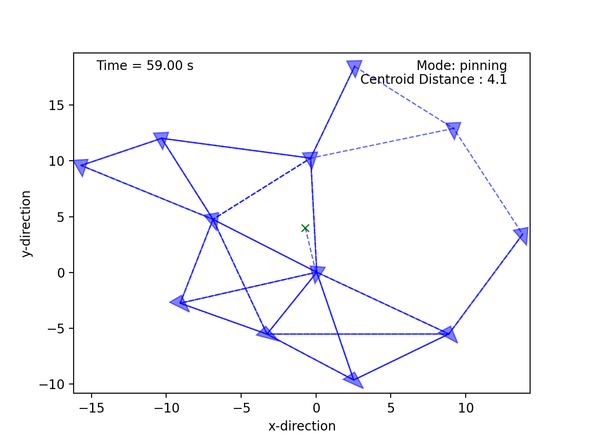

<p align="center">
  
</p>

# Multi-agent Coordination Simulator

This project implements various multiagent coordination techniques including flocking, pinning control, dynamic encirclement, arbitrary closed curves, shepherding, and counter-malicious agent control. 
All agents make individual decisions based on local information only. There is no global plan. 


---

# Methodology

The swarming techniques above are all implemented as high-level trajectory planners, assuming underlying double integrator dynamics. 
When quadcopter dynamics are applicable, these command signals - which take the form of accelerations in Cartesian space - are then converted into velocity setpoints.
The quadcopters make use of 3 nested control loops (translational velocity, angular position, and angular velocity) to track the desired trajectory.

---

# Project Structure


```
├── agents/                  # agent definitions
├── config/                  # location of configuration file
├── data/                    # data storage
├── experiments/             # consolidated data, configs, plots (when flagged)
├── learner/                 # learning-related modules
├── obstacles/               # obstacle definitions 
├── planner/                 # swarming techniques stored as "planners"
│   ├── trajectory.py        # placeholder for trajectory definitions
│   └── techniques/          # technique definitions
├── targets/                 # target definitions
├── utils/                   # utility scripts 
├── visualization/           # animations and plots
├── orchestrator.py          # master controller (integrates all other components)
├── main.py                  # main script
```

---

# Operation

Parameters for each module (for example, encirclement radius) are set within the respective technique definitions file.
Global simulations parameters are set within the main script. The parameters are all dropped in the configuration file.

To run a simulation, adjust the parameters as desired and then run as follows from the root folder:

```bash
 python main.py
```


---

# Examples

<p float="center">
     
    
    <figcaption style="font-size: 1em; margin-top: 5px;"><strong> Assembly: </strong> 50 agents with conflicting initial lattice parameters automatically negotiating and assembling. </figcaption>
</p>

<p float="center">
     
    <figcaption style="font-size: 1em; margin-top: 5px;"><strong> Assembly: </strong> 12 agents conflicting initial lattice parameters, showing sensor ranges. </figcaption>
</p>

<p float="center">
     
    
    
     
    <figcaption style="font-size: 1em; margin-top: 5px;"><strong> Lattice variations: </strong> Other examples with quadcopters, obstacles, and various lattice types. </figcaption>
</p>

<p float="center">
    
    
    
    
    <figcaption style="font-size: 1em; margin-top: 5px;"><strong> Dynamic Structures: </strong> Shepherding, encirclment, and lemniscate trajectories. </figcaption>
</p>

<p float="center">
      
    
      
    
    <figcaption style="font-size: 1em; margin-top: 5px;"><strong> Malicious Agents: </strong> Compensating for the presence of malicious agents. </figcaption>
</p>

---

# Some other special features:

*  2D and 3D simulations
*  Various agent shapes (dots, prisms, ... etc)
*  Double-integrator and quadcopter dynamics 
*  Interconnectedness is represented as a Graph
*  Flocking with heterogeneous lattice scales
*  [Reinforcement learning to adjust flocking scale](https://github.com/tjards/assembly_via_Q-learning)
*  Lemniscates formed as [twisted circles](https://github.com/tjards/twisted_circles)
*  [Malicious agents](https://github.com/tjards/flocking_malicious)
*  [Various potential functions](https://github.com/tjards/survey_potential_functions)
* [Linearization and Dimensionality Reduction using UMAP](https://github.com/tjards/UMAP_twisted_circles) 


--- 

# References 

1. Craig Reynolds, ["Flocks, Herds, and Schools:A Distributed Behavioral Model"](https://www.red3d.com/cwr/papers/1987/boids.html), *Computer Graphics, 21(4) (SIGGRAPH '87 Conference Proceedings)*, pages 25-34, 1987.
2. Reza Olfati-Saber, ["Flocking for Multi-Agent Dynamic Systems: Algorithms and Theory"](https://ieeexplore.ieee.org/document/1605401), *IEEE Transactions on Automatic Control*, 
Vol. 51 (3), 2006.
3. H. Hildenbrandt, C. Carere, and C.K. Hemelrijk,["Self-organized aerial displays of thousands of starlings: a model"](https://academic.oup.com/beheco/article/21/6/1349/333856?login=false), *Behavioral Ecology*, Volume 21, Issue 6, pages 1349–1359, 2010.
4. P. T. Jardine and S. N. Givigi, ["Flocks, Mobs, and Figure Eights: Swarming as a Lemniscatic Arch"](https://ieeexplore.ieee.org/document/9931405), *IEEE Transactions on Network Science and Engineering*, 2022.
5. Kléber M. Cabral, Sidney N. Givigi, and Peter T. Jardine, [Autonomous assembly of structures using pinning control and formation algorithms](https://ieeexplore-ieee-org.proxy.queensu.ca/document/9275901) in 2020 IEEE International Systems Conference (SysCon), 07 Dec 2020
6. S. Van Havermaet et al. ["Steering herds away from dangers in dynamic environments"](https://royalsocietypublishing.org/doi/10.1098/rsos.230015) in *Royal Society Open Science*, 2023
7. C. Zhang, H. Yang, B. Jiang and M. Cao, ["Flocking Control Against Malicious Agent"](https://ieeexplore.ieee.org/document/10264142) in *IEEE Transactions on Automatic Control*, vol. 69, no. 5, pp. 3278-3285, May 2024
8. P. T. Jardine and S. Givigi, ["Emergent homeomorphic curves in swarms"](https://doi.org/10.1016/j.automatica.2025.112221) in *Automatica*, vol. 176, 2025
9. Credit goes to [bobzwik](https://github.com/bobzwik) for providing the majority of the [Quadcopter dynamics module](https://github.com/tjards/multi-agent_sim/tree/master/agents/quadcopter_module) code under MIT licence, which I modified to suit this application (portions of the code are annotated appropriately)
10. Credit goes to [ericjhkim](https://github.com/ericjhkim) for providing code for prism agent shape

# Citing

The code is opensource but, if you reference this work in your own research, please cite me. I have provided an example bibtex citation below:

`@techreport{Jardine-2025,
  title={Multi-agent Coordination Simulator},
  author={Jardine, P.T.},
  year={2025},
  institution={Queen's University, Kingston, Ontario},
  type={GitHub Repository},
}`

Alternatively, you can cite any of my related papers, which are listed in [Google Scholar](https://scholar.google.com/citations?hl=en&user=RGlv4ZUAAAAJ&view_op=list_works&sortby=pubdate).















 

