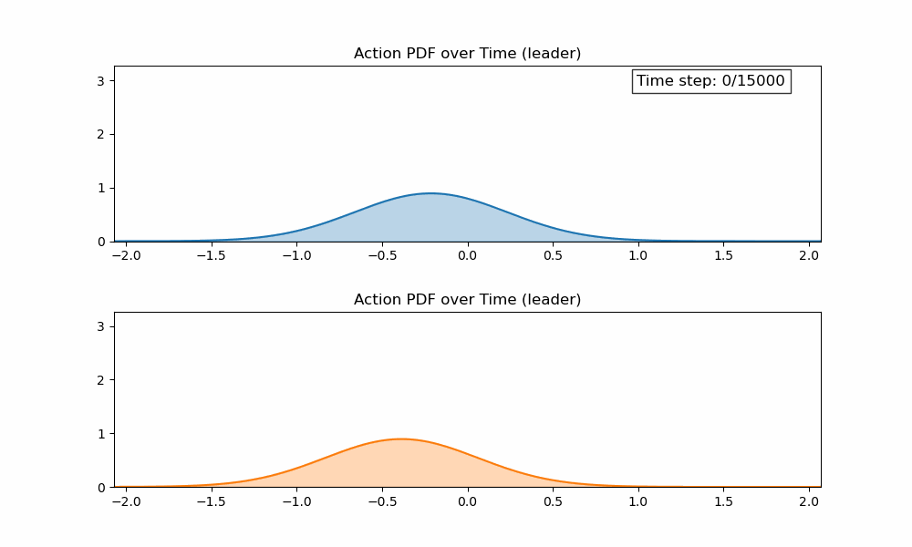
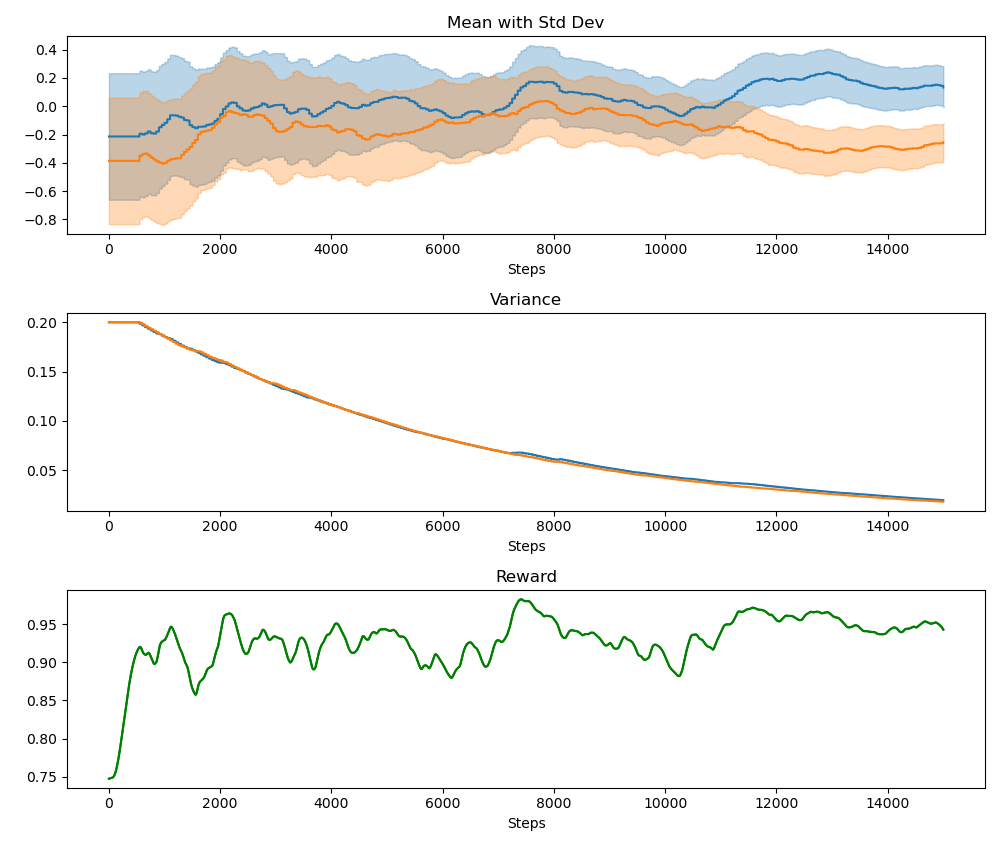
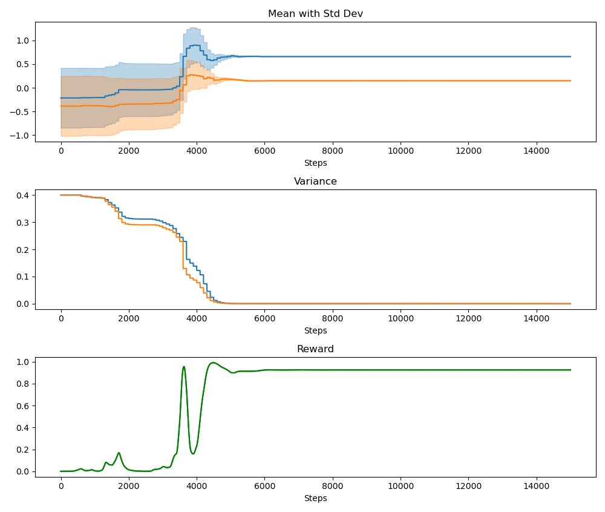

# Development Notes

This document is a place for developers to collaborate on various aspects of this project.

Updated: 2024-09-21 at 16:03 EST.

## Hypospace learning

Summary: Initially proposed in [this](https://github.com/tjards/hypospace_learning) repo, we introduced a technique for control the orientation of a [Lemniscatic Arch](https://ieeexplore.ieee.org/document/9931405) swarm using reinforcement learning; specifically, we using [Continuous Action Learning Automata (CALA)](https://github.com/tjards/continuous_action_learning_automata) to tune offset angles around the $x$- and $z$-axes. 

We have since integrated this technique into the broader multi-agent framework. 

### Files in play

The following files are in play for this project:

```
# where the learning happens       
├── learner/CALA_control.py 

# we use a manually-placed obstacle as a reference landmark for learning. The swarms is training to align to aim itself as this. The axis for alignment is defined by a line drawn from the center of mass of the swarm to the center of the lemniscate trajectory.          
├── obstacles/obstacles.py

# this is where the lemniscate trajectory is defined (and uses the learned offsets)
├── planner/techniques/lemni_tools.py                 

# all this drives a desired trajectory, which is stored here 
├── planner/trajectory.py        

# the underlying control to follow this trajectory is orchestrated by a master controller here (integrates all other components)
├── orchestrator.py         
```

### Where the work needs to be done

#### Inter-agent communication

For now, all agents share their statistics and the learned parameter. This is just to get things working. We'll loosen this up later.

This is accomplished near line 165 in `learner/CALA_control.py` at negotiate_with_neighbours(). This is accomplished by setting the flag `leader_follower = True` and setting the `leader = 0`. This means agent 0 does all the learning. 

#### Applying the learned offsets

Around line 263 in `planner/techniques/lemni_tools.py`, we define the lemniscate trajectory. This is where we integrate the learned offsets from CALA. This ultimately drives the orientation of the swarm.

```python
# -------------------------- #
# offset by learned parameter
# -------------------------- #

lemni[0, m] = base_theta  

if 'x' in learning_axes:
    lemni[0, m] += learn_actions.get('x', np.zeros(nVeh))[m]
    
if 'z' in learning_axes:

    lemni[1, m] = learn_actions.get('z', np.zeros(nVeh))[m]

```

I think we should instead be learning some kind of policy, rather than the offset directly. It sort of works, but I think we can do better.

#### Reward structure

For now, we couple the rewards in the $x$- and $z$-axes by setting the flag `reward_coupling == 2`. 

Around line 331 in `learner/CALA_control.py`, we define the reward structure. 

```python
def update_reward_increment(self, k_node, state, centroid, focal, target, mode):
    
    if self.reward_mode == 'target':
        
        reference   = 'global'      # 'global' (default),   'local' (not working yet)
        reward_form = 'dot'         # 'dot'(default),       'angle' (not working yet)
        
        # compute the heading vector (centered on centroid)
        v_centroid      = centroid[0:3, 0]
        v_focal         = focal[0:3]
        v_heading       =  v_centroid - v_focal
        
        # compute the target vector (centered on centroid)
        if target.shape[1] == 0:
            v_target = - v_focal
        else:
            v_target = target[0:3, 0] - v_focal
        
        # =============
        # when coupled
        # =============
        
        if reward_coupling == 2:
            
            if reference == 'global':
                
                v1 = v_heading
                v2 = v_target
    
                
                if reward_form == 'dot':
    
                    v1 /= (np.linalg.norm(v1) + epsilon)
                    v2 /= (np.linalg.norm(v2) + epsilon)
                    reward = (np.dot(v1, v2) + 1) / 2


                elif reward_form == 'angle':
                    
                    reward_sigma = 0.5
                    v1 /= (np.linalg.norm(v1) + epsilon)
                    v2 /= (np.linalg.norm(v2) + epsilon)
                    angle_diff = np.arccos(np.clip(np.dot(v1, v2), -1.0, 1.0))
                    reward = np.exp(-angle_diff**2 / reward_sigma**2)  # Gaussian bump at 0

```

Essentially, we are attempting to maximize the value of the dot product between the heading vector (from the focal agent to the centroid of the swarm) and the target vector (from the focal agent to the target landmark). This short or works... but I think we need to work on this.

#### Results so far 

It's learning, but not very well.

<p float="center">
     
    <figcaption style="font-size: 1em; margin-top: 5px;">Fig.1 - Probability Distribution Function (PDF) of altitude (blue) and azimuth (orange) parameters. </figcaption>
</p>

<p float="center">
     
    <figcaption style="font-size: 1em; margin-top: 5px;">Fig. 2 - Here we see the rewards are being maximized, but not well. </figcaption>
</p>

Update (21 Sep at 19:58), I simply sharpened the reward function and got much better results:

<p float="center">
     
    <figcaption style="font-size: 1em; margin-top: 5px;">Fig. 2 - Here we see the rewards are being maximized, but not well. </figcaption>
</p>

