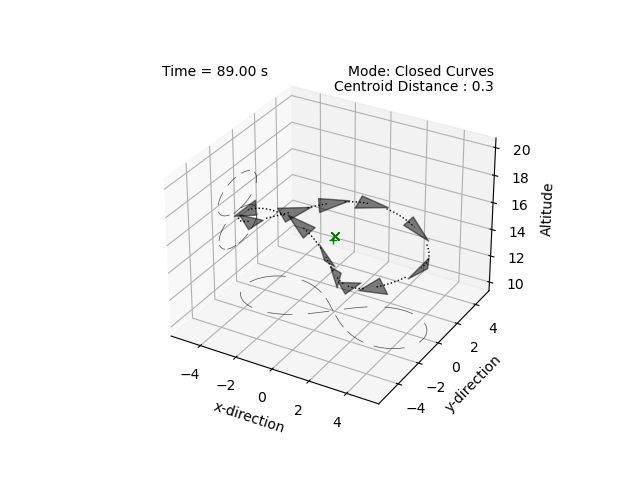
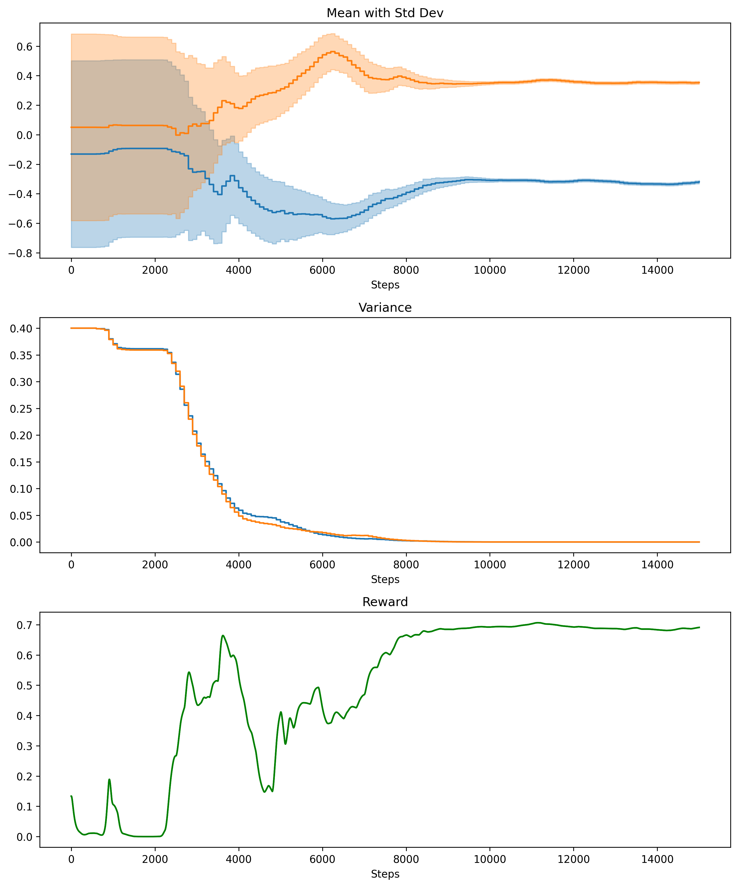
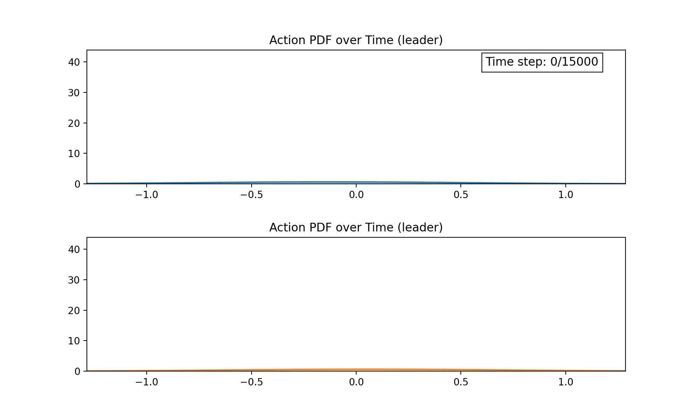
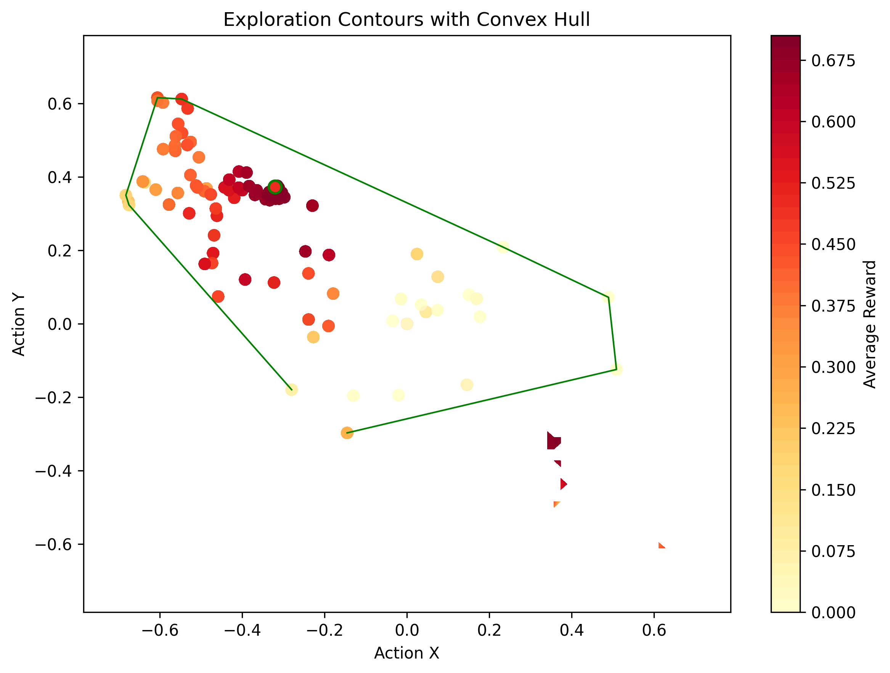

# Dynamic Structures with Reinforcement Learning

We are also interested in producing more structured trajectories, primarily lemniscates. More recently, we have started investigating the use of reinforcement learning to optimize the orientation of the larger structure. 

## Related work

1. P. T. Jardine and S. N. Givigi, ["Flocks, Mobs, and Figure Eights: Swarming as a Lemniscatic Arch"](https://ieeexplore.ieee.org/document/9931405), *IEEE Transactions on Network Science and Engineering*, 2022.

2. P. T. Jardine and S. Givigi, ["Emergent homeomorphic curves in swarms"](https://doi.org/10.1016/j.automatica.2025.112221) in *Automatica*, vol. 176, 2025.

## Circles and Twisted Circles 

    
    
    <figcaption style="font-size: 1em; margin-top: 5px;"><strong> Dynamic Structures: </strong> Lemniscate trajectories. </figcaption>

    
    <figcaption style="font-size: 1em; margin-top: 5px;"><strong> Dynamic Structures: </strong> Encirclement. </figcaption>

## Reinforce Learning 

The curves above are produced using a geometric embedding technique, which allows us to produce a wide variety of emergent trajectories using a single underlying control policy. The orientation of this embedding can be optimized using reinforcement learning. Below is an exampled using Continuous Action Learning Automata (CALA).

    
    <figcaption style="font-size: 1em; margin-top: 5px;"><strong> Reinforcement Learning: </strong>Initial results for learning optimal embedding orientations. </figcaption>

    
    <figcaption style="font-size: 1em; margin-top: 5px;"><strong> Reinforcement Learning: </strong>Illustration of the distribution of learned policies over time. </figcaption>

    
    <figcaption style="font-size: 1em; margin-top: 5px;"><strong> Reinforcement Learning: </strong>Illustration of the explored action space. </figcaption>

