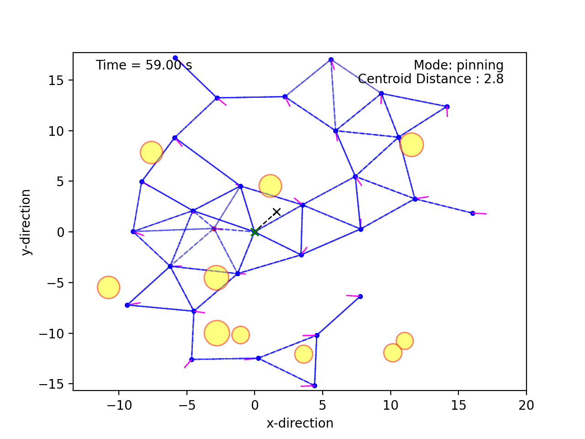
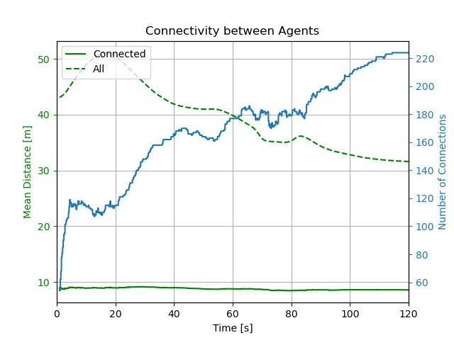
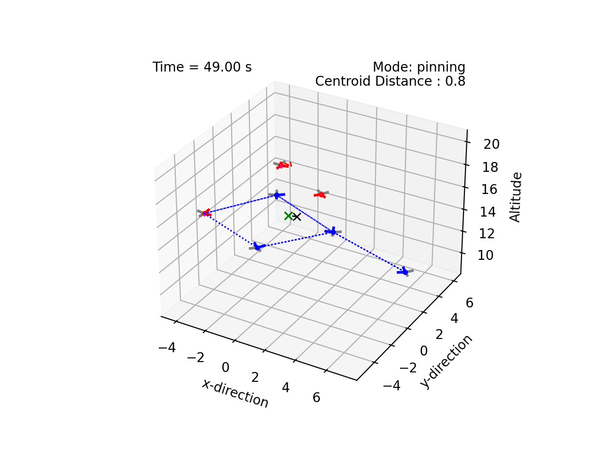
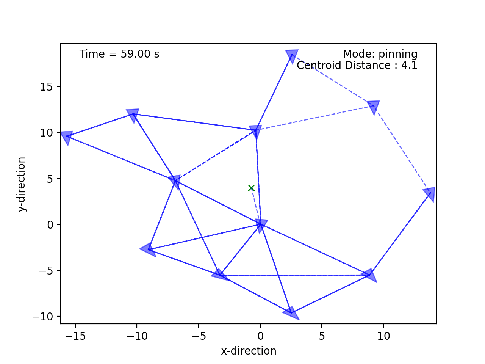

# Basic Interactions 

Below are examples of various interactions that can be implemented in the multi-agent simulator. These examples are not exhaustive, but are meant to illustrate the flexibility of the simulator for a wide range of multi-agent scenarios.

## Related works

1. Reza Olfati-Saber, ["Flocking for Multi-Agent Dynamic Systems: Algorithms and Theory"](https://ieeexplore.ieee.org/document/1605401), *IEEE Transactions on Automatic Control*, 
Vol. 51 (3), 2006.

2. Kléber M. Cabral, Sidney N. Givigi, and Peter T. Jardine, [Autonomous assembly of structures using pinning control and formation algorithms](https://ieeexplore-ieee-org.proxy.queensu.ca/document/9275901) in 2020 IEEE International Systems Conference (SysCon), 07 Dec 2020.

3. P. T. Jardine and S. Givigi, ["Agree to Disagree: Consensus-free Flocking under Constraints"](https://arxiv.org/abs/2601.19119) in *arXiv*.

4. Craig Reynolds, ["Flocks, Herds, and Schools:A Distributed Behavioral Model"](https://www.red3d.com/cwr/papers/1987/boids.html), *Computer Graphics, 21(4) (SIGGRAPH '87 Conference Proceedings)*, pages 25-34, 1987.

5. H. Hildenbrandt, C. Carere, and C.K. Hemelrijk,["Self-organized aerial displays of thousands of starlings: a model"](https://academic.oup.com/beheco/article/21/6/1349/333856?login=false), *Behavioral Ecology*, Volume 21, Issue 6, pages 1349–1359, 2010.

6. P. T. Jardine and S. N. Givigi, ["Flocks, Mobs, and Figure Eights: Swarming as a Lemniscatic Arch"](https://ieeexplore.ieee.org/document/9931405), *IEEE Transactions on Network Science and Engineering*, 2022.

7. S. Van Havermaet et al. ["Steering herds away from dangers in dynamic environments"](https://royalsocietypublishing.org/doi/10.1098/rsos.230015) in *Royal Society Open Science*, 2023.

## Examples

     
    <figcaption style="font-size: 1em; margin-top: 5px;"><strong> Assembly: </strong> While avoiding obstacles. </figcaption>

     
    
    <figcaption style="font-size: 1em; margin-top: 5px;"><strong> Assembly: </strong> 50 agents with conflicting initial lattice parameters automatically negotiating and assembling. </figcaption>

    
    <figcaption style="font-size: 1em; margin-top: 5px;"><strong> Shepherding: </strong> Red agents attempt to shepherd Blue agents into a desired location.</figcaption>

     
    
    <figcaption style="font-size: 1em; margin-top: 5px;"><strong> Lattice variations: </strong> Quadcopters and showing sensor ranges. </figcaption>

    
     
    <figcaption style="font-size: 1em; margin-top: 5px;"><strong> Lattice variations: </strong> Other examples with various lattice types. </figcaption>

