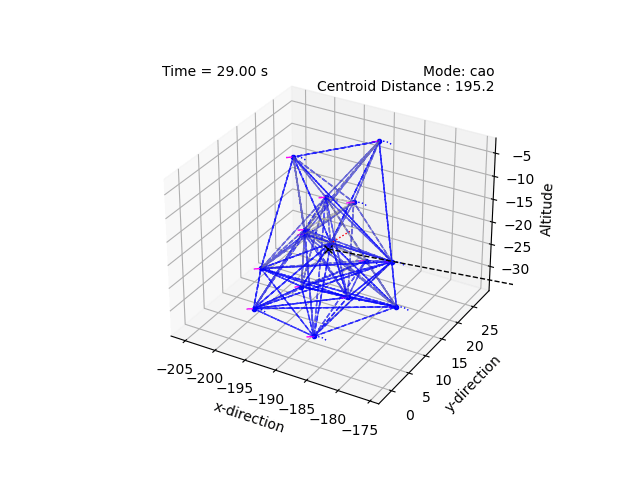
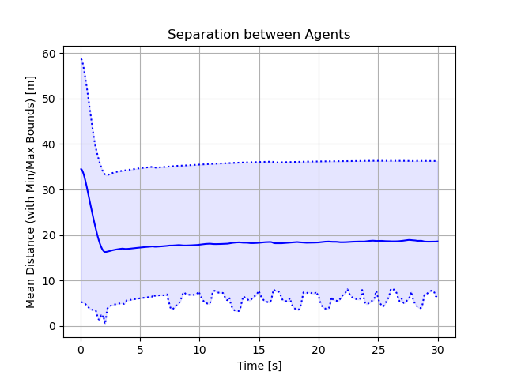
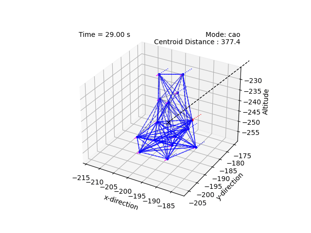
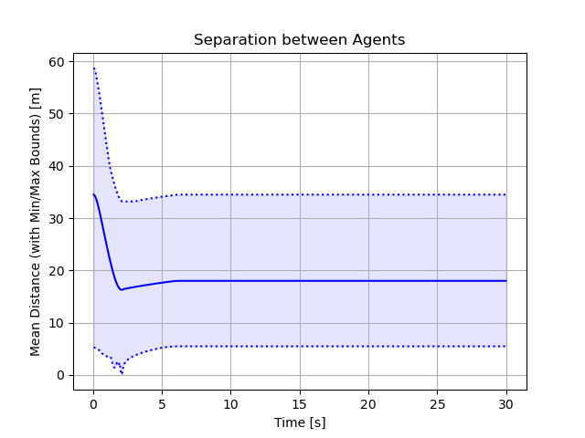

# Malicious Agents

We investigate ways to deal with malicious agents in the swarm.

## Related work

1. C. Zhang, H. Yang, B. Jiang and M. Cao, ["Flocking Control Against Malicious Agent"](https://ieeexplore.ieee.org/document/10264142) in *IEEE Transactions on Automatic Control*, vol. 69, no. 5, pp. 3278-3285, May 2024.

## Examples

      
    
    <figcaption style="font-size: 1em; margin-top: 5px;"><strong> Malicious Agents: </strong> Not compensating for the presence of malicious agents. </figcaption>

      
    
    <figcaption style="font-size: 1em; margin-top: 5px;"><strong> Malicious Agents: </strong> Compensating for the presence of malicious agents. </figcaption>

